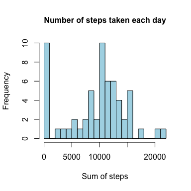
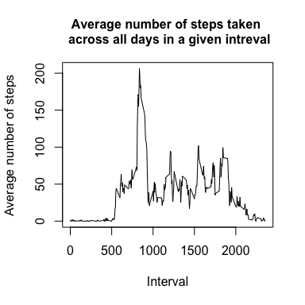
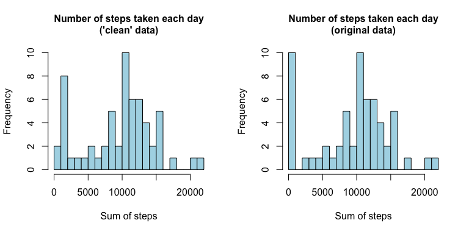
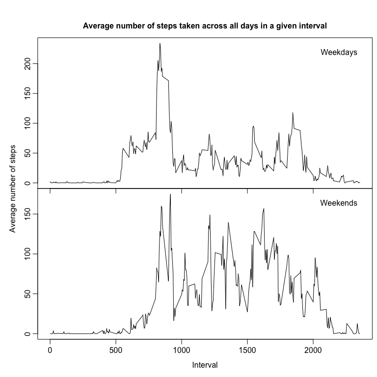

# Reproducible Research: Peer Assessment 1
This document relates to the project "Peer Assessment 1" as part of the Coursera course 
"Reproducible Research". 

## Data
The data for this assignment - including explanatory documentation - is available 
via this [Github repository](http://github.com/rdpeng/RepData_PeerAssessment1). This
repository was forked to my own Github account and subsequently cloned to the local disk. 
As a further prepatory step, the current working directory was set to same the location 
the repository was cloned to. Any commands following will therefore be relative to the 
parent directory of the cloned repository.

## Loading and preprocessing the data
The data is contained in a zipped archive which requires an additional step before the table can be read:

```r
  tmp_activity <- unzip("./activity.zip")
  activity <- read.csv(tmp_activity)
```

## What is mean total number of steps taken per day?
By default, "read.csv" reads the date as a factor with 61 levels for the different dates. 
Use "ddply" to determine group-wise summary 

```r
  library(plyr)
  sum_of_steps_per_day <- ddply(activity, .(date),  summarise, sum = sum(steps,na.rm=TRUE))
```
and show the histogram of the data:


Now that we have the total number of steps taken each day, we can calculate the mean and the median of this distribution:

```r
  mean(sum_of_steps_per_day$sum,na.rm=TRUE)
```

```
## [1] 9354.23
```

```r
  median(sum_of_steps_per_day$sum,na.rm=TRUE)
```

```
## [1] 10395
```

## What is the average daily activity pattern?

Using a similar approach as above, we summarise the data according to the the intervals using the mean:

```r
  mean_of_steps_per_interval <- ddply(activity, .(interval),  summarise, mean = mean(steps,na.rm=TRUE))
```
This can be plotted as:

The plot reveals a significant spike around the 800 interval. More precisely, the peak 
appears at interval:

```r
  mean_of_steps_per_interval$interval[mean_of_steps_per_interval$mean == max(mean_of_steps_per_interval$mean)]
```

```
## [1] 835
```

## Imputing missing values
A number of days/intervals show missing values in the original data set (coded a "NA"). This 
applies to a total number of:

```r
  sum(!complete.cases(activity))
```

```
## [1] 2304
```

We can also make certain that only the steps variable shows "NAs":

```r
  sum(!complete.cases(activity$steps))
```

```
## [1] 2304
```

```r
  sum(!complete.cases(activity$date))
```

```
## [1] 0
```

```r
  sum(!complete.cases(activity$interval))
```

```
## [1] 0
```

In order to brige the gaps introduced by these missing values, we can replace the "NAs" with 
values infered from the rest of the data. Here we chose to replace "NAs" in the steps
variable with the median of the steps taken across all days for the same interval the "NAs" 
appear in. 


```r
  median_of_steps_per_interval <- ddply(activity, .(interval),  
                                        summarise, median = median(steps,na.rm=TRUE))
  activity_clean <- activity
  myfunc <- function(x){
    activity_clean$steps[x] <- 
      median_of_steps_per_interval$median[median_of_steps_per_interval$interval == x]
  }
  activity_clean$steps[!complete.cases(activity_clean)] <- 
    sapply(activity$interval[!complete.cases(activity)], myfunc)
```
With this new data set we can recalculate the total number of steps taken per day

```r
  sum_of_steps_per_day_clean <- ddply(activity_clean, .(date),  summarise, sum = sum(steps,na.rm=TRUE))
```
and compare the histogram to the original plot:

We can see that slight differences have been introduced, mainly for the bins at the left end 
of the distributions. The mean value of steps per day over all days increased slightly while the median remained the same:

```r
  mean(sum_of_steps_per_day_clean$sum,na.rm=TRUE)
```

```
## [1] 9503.869
```

```r
  median(sum_of_steps_per_day_clean$sum,na.rm=TRUE)
```

```
## [1] 10395
```

## Are there differences in activity patterns between weekdays and weekends?
To answer this question, we have to create a new variable encoding whether or not a given date is on a weekday or on a week end. First, create a boolean variable showing if we are 
on a weekday or not:

```r
  activity$weekday <- !(weekdays(as.Date(activity$date)) %in% c('Saturday','Sunday'))
```
Then we can convert this into a factor variable:

```r
  activity$weekday <- factor(activity$weekday,labels=c("weekend","weekday"))
```
Now we can visually compare the activity on weekdays with that on weekends:



